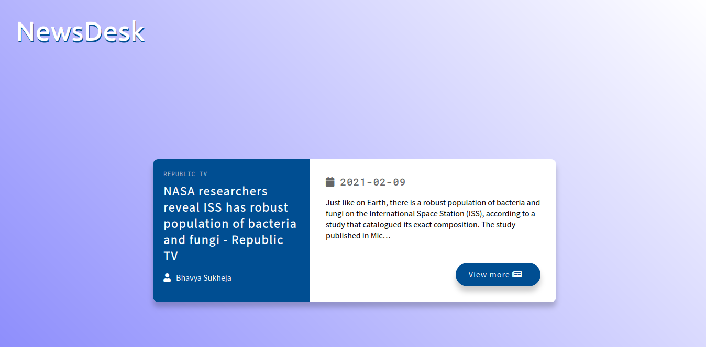

# NEWSDESK

This is a simple web application that fetches news using NEWS api

# IDEA

## TODO
- [x] Create boilerplates

- [x] Get fonts and and fontawsome library

- [x] Link CSS and JS

- [x] Set background

- [x] Add heading

- [x] Colour the heading

- [x] Add a simple shadow to text

- [x] Create left side of card

- [x] Create right side of the card

- [x] Add search field

- [x] Style search field
 